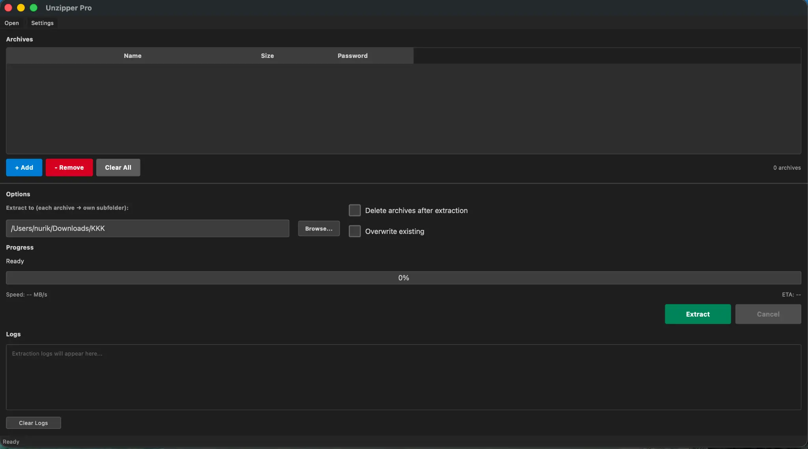

# Unzipper Pro 2.0

A professional native desktop application for extracting archives. Built with C++ and Qt6, it extracts every file from ZIP, 7Z, RAR, and TAR archives—including empty files, directories, and symlinks.



## Download

- **Windows:** [UnzipperPro.exe](https://github.com/NULLSHADExXx/unzipper-pro/releases/latest)
- **macOS:** [UnzipperPro.dmg](https://github.com/NULLSHADExXx/unzipper-pro/releases/latest)
- **Linux:** [UnzipperPro-linux-x64](https://github.com/NULLSHADExXx/unzipper-pro/releases/latest)

No installation required—just download and run!

## What It Does

Unzipper Pro extracts archives to your chosen folder. Each archive is unpacked into its own subfolder. You can queue multiple archives, set per-archive passwords, and run extractions in parallel. The app uses libarchive for robust, complete extraction of all contents.

## Features

| Feature | Description |
|--------|-------------|
| **Full extraction** | Extracts every file, folder, symlink, and empty file from archives |
| **Multi-format** | ZIP, 7Z, RAR, CBR, TAR, TAR.GZ, TAR.BZ2, TAR.XZ |
| **Large archives** | Streaming decompression handles 100GB+ archives without loading into memory |
| **Batch processing** | Add multiple archives and extract them in one run |
| **Parallel extraction** | Extract 1–8 archives at once (configurable in Settings) |
| **Per-archive passwords** | Password field for each archive; Show/Hide toggle |
| **Drag & drop** | Drop archives onto the window to add them |
| **Real-time progress** | Speed (MB/s) and ETA during extraction |
| **Delete after extract** | Optionally remove archives after successful extraction |
| **Verify before delete** | Optional integrity check before deleting (Settings) |
| **Dark theme UI** | Clean, consistent interface |
| **Cross-platform** | Windows, macOS, Linux |

## Supported Formats

| Format | Extensions |
|--------|------------|
| ZIP | .zip |
| 7-Zip | .7z |
| RAR | .rar, .cbr |
| TAR | .tar |
| TAR GZIP | .tar.gz, .tgz |
| TAR BZIP2 | .tar.bz2 |
| TAR XZ | .tar.xz |

## Usage

1. **Add archives** — Click "+ Add" or drag and drop files onto the window  
2. **Set passwords** — Enter passwords in the Password column if needed; use Show/Hide to verify  
3. **Choose output folder** — Click "Browse..." next to the path  
4. **Options** — Enable "Delete archives after extraction" and/or "Overwrite existing"  
5. **Extract** — Click the green "Extract" button  
6. **Monitor** — Follow progress, speed, and ETA in the Progress section  

Each archive extracts into its own subfolder under the output path (e.g. `output/myarchive/`).

## Settings

Open via **File → Settings** or the Settings toolbar button.

| Setting | Description |
|---------|-------------|
| **Default output folder** | Initial extraction destination |
| **Delete archives after extraction** | Default for the main checkbox |
| **Overwrite existing files** | Default for the main checkbox |
| **Max parallel extractions** | 1–8 archives at a time (default: CPU cores, capped at 8) |
| **Clear archive list after successful extraction** | Empties the list when done |
| **Play sound when extraction completes** | System notification sound |
| **Verify integrity before deleting archives** | Re-reads archives after extraction before delete |

## Building from Source

### Prerequisites

**macOS:**
```bash
brew install cmake qt@6 libarchive
```

**Ubuntu/Debian:**
```bash
sudo apt install build-essential cmake qt6-base-dev libarchive-dev
```

**Fedora:**
```bash
sudo dnf install gcc-c++ cmake qt6-base-devel libarchive-devel
```

**Windows:**
- Visual Studio 2019 or later
- Qt6 (qt.io)
- libarchive

### Build

```bash
cd unzipper_native
mkdir build && cd build
cmake ..
cmake --build . --config Release
```

### Run

**macOS:** `open UnzipperPro.app`  
**Linux:** `./UnzipperPro`  
**Windows:** `UnzipperPro.exe`

Use `./build.sh` (macOS/Linux) or `build.bat` (Windows) for a build script that installs dependencies and builds the app.

## System Requirements

- **Windows:** Windows 7+, Qt6, libarchive  
- **macOS:** macOS 10.13+, Qt6, libarchive  
- **Linux:** Ubuntu 18.04+ / Debian 10+ / Fedora 30+, Qt6, libarchive  

## Architecture

- **mainwindow_pro.cpp** — Main UI (archive list, options, progress, logs)  
- **extractionworker.cpp** — Extraction engine (libarchive, streaming, parallel jobs)  
- **settingsdialog.cpp** — Settings dialog  
- **libarchive** — Handles all archive formats via `archive_read` and `archive_write_disk`  

Extraction runs in background threads so the UI stays responsive. Progress updates are throttled to about 150 ms.

## Troubleshooting

| Issue | What to do |
|-------|------------|
| Wrong password | Recheck the password; each archive can use a different one |
| Cannot open / corrupted | Ensure the file isn’t corrupted; try downloading again |
| Permission denied | Verify output folder permissions |
| No space left | Free disk space in the output folder |
| Slow extraction | Check disk health; use a different output drive if needed |

## Contributing

Contributions are welcome. Open an issue or submit a pull request.

## License

Free for everyone. Use, modify, and share — but never for sale. See [LICENSE](LICENSE).

---

**Unzipper Pro 2.0** — Open source archive extraction for Windows, macOS, and Linux
